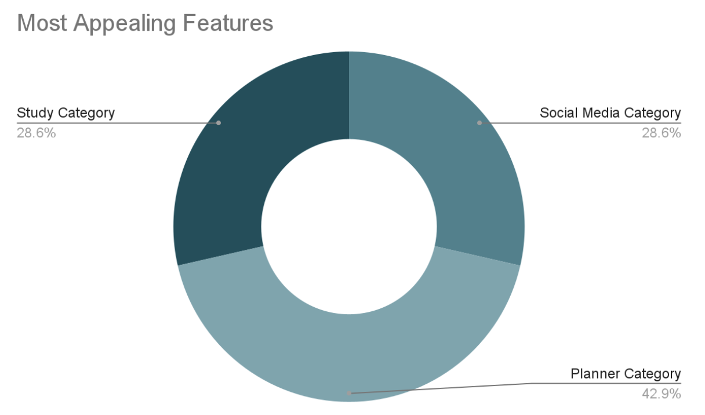
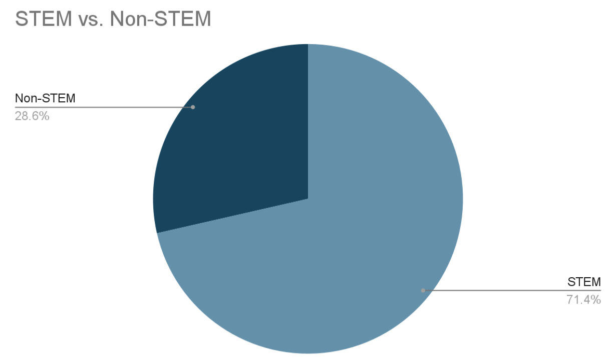
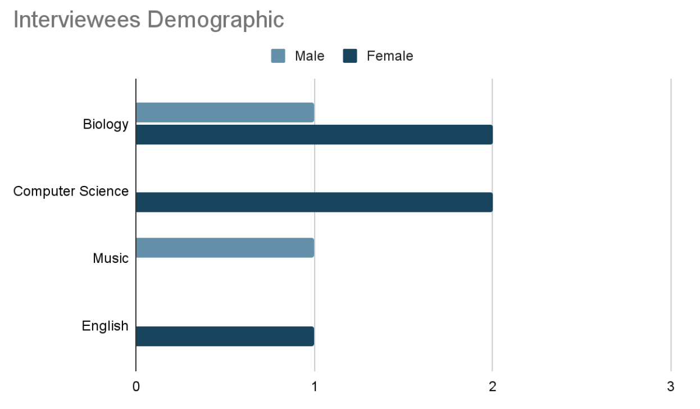
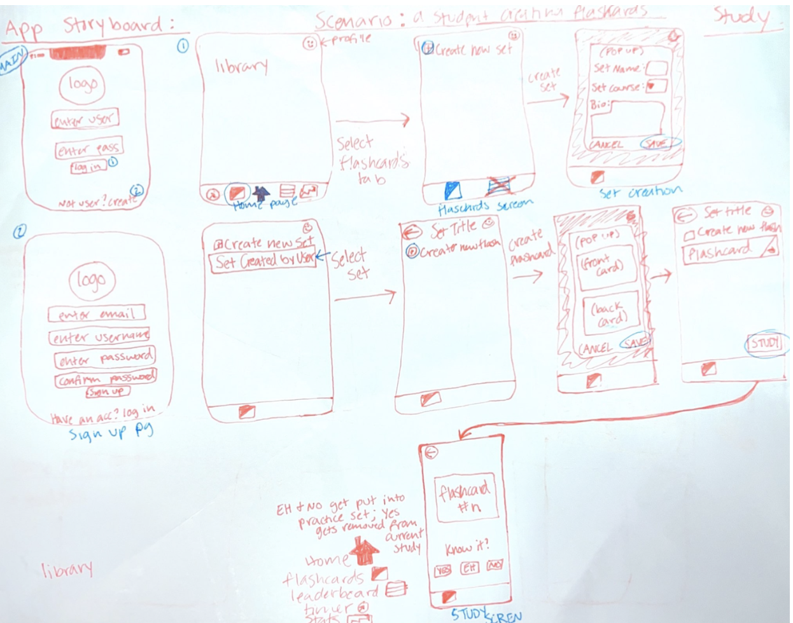
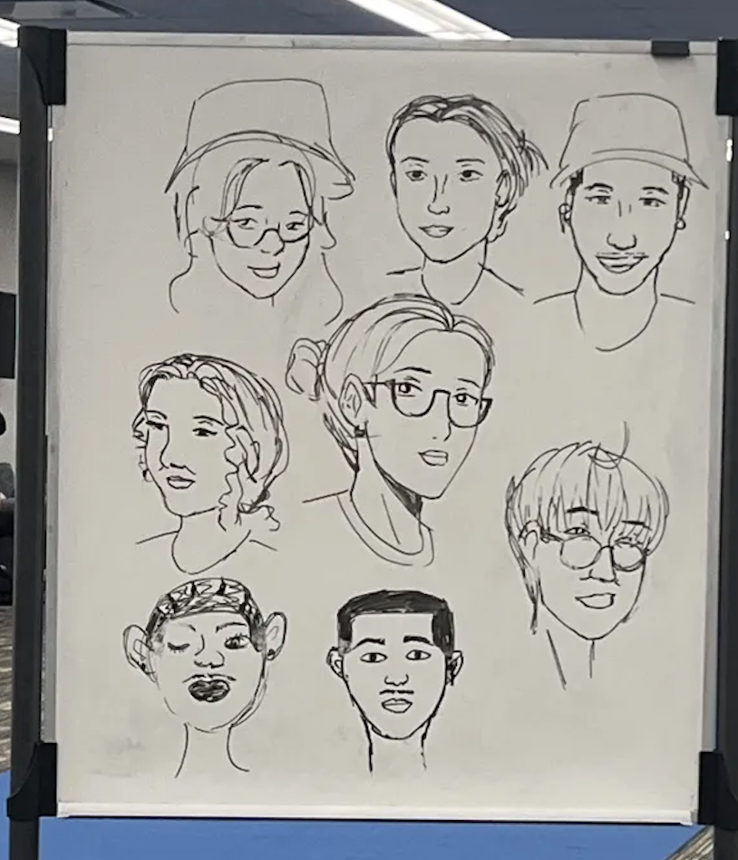
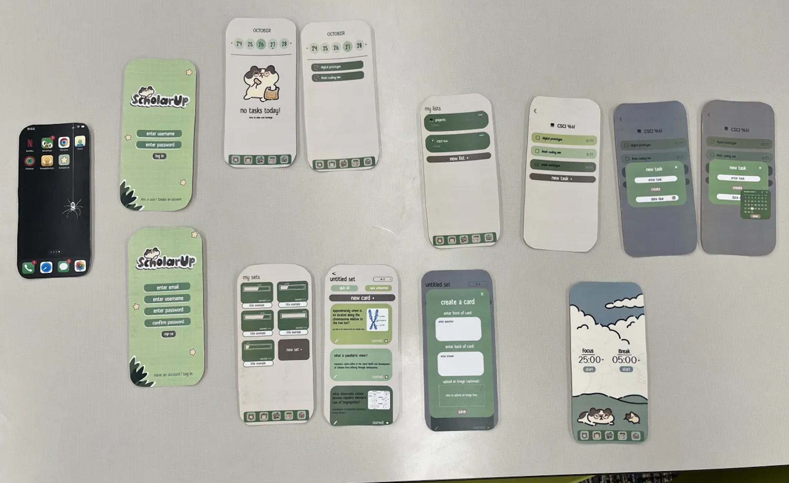
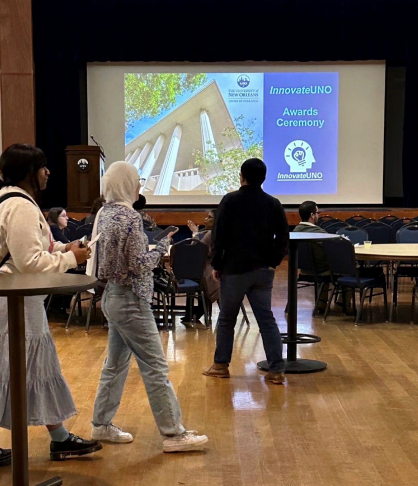

- [:green\_apple: About ScholarUp](#green_apple-about-scholarup)
  - [📗 Features](#-features)
- [📦 Screenshots](#-screenshots)
  - [Flash Card Screens](#flash-card-screens)
  - [To Do List Screens](#to-do-list-screens)
  - [Study Timer and Home Page Screen](#study-timer-and-home-page-screen)
  - [App Icon](#app-icon)
- [:green\_apple: ScholarUp Case Study](#green_apple-scholarup-case-study)
  - [Milestone 2: Problem Analysis and Project Proposal](#milestone-2-problem-analysis-and-project-proposal)
    - [Problem Statement](#problem-statement)
    - [Solution: ScholarUp](#solution-scholarup)
    - [Stakeholders](#stakeholders)
    - [Competitive Analysis](#competitive-analysis)
  - [Milestone 3: Competitive Analysis](#milestone-3-competitive-analysis)
    - [Inspiration from Existing Apps](#inspiration-from-existing-apps)
    - [Conclusion](#conclusion)
  - [Milestone 4: Stakeholder Interviews](#milestone-4-stakeholder-interviews)
    - [Key Insights from User Feedback](#key-insights-from-user-feedback)
    - [Synthesis Report Findings](#synthesis-report-findings)
    - [Graphs](#graphs)
  - [Milestone 5: Storyboard](#milestone-5-storyboard)
  - [Milestone 6: Paper Prototype Testing](#milestone-6-paper-prototype-testing)
    - [Testing Observations](#testing-observations)
    - [Key Takeaways from Testing](#key-takeaways-from-testing)
  - [Final Milestone: Deliverable (Final Features)](#final-milestone-deliverable-final-features)
    - [✅ Study Tools](#-study-tools)
    - [✅ Planning](#-planning)
    - [✅ Social \& Gamification](#-social--gamification)
    - [Impact \& Future Improvements](#impact--future-improvements)
    - [Conclusion](#conclusion-1)
  - [✨ Installation](#-installation)
  - [📲 Running ScholarUp](#-running-scholarup)
      - [With the terminal](#with-the-terminal)
      - [With Android Studio](#with-android-studio)
  - [:pencil: Meet the Creators:](#pencil-meet-the-creators)
    - [Jenny Spicer](#jenny-spicer)
    - [Jumana Suleiman](#jumana-suleiman)
    - [Kailey Bergeron](#kailey-bergeron)
  - [:trophy: InnovateUNO](#trophy-innovateuno)
    - [Handmade Charms Made for the Audience](#handmade-charms-made-for-the-audience)
  - [:microphone: ULS Academic Summit 2024](#microphone-uls-academic-summit-2024)


# :green_apple: About ScholarUp
> [!NOTE]
> ScholarUp is our study app created for our Mobile Applications Development course in Fall 2023; presented at InnovateUNO (2023) and the Annual ULS Academic Summit (2024).

ScholarUp is a mobile study app that combines studying, planning, and aesthetics. It holds all the features you need to study consistently and successfully, while also having a cute and consistent color scheme.  

## 📗 Features
• **Flashcards:** Create new flashcard stacks, add items to it, practice the cards, and star what you know.<br>
• **To Do Lists:** Create To Do lists, add items to the lists, and check off the ones you completed.<br>
• **Study Timer:** Time how long it takes you to study as well as have a set break.<br>

# 📦 Screenshots   
 <div>
    
    
</div>

 ## Flash Card Screens
<div>


</div>

## To Do List Screens
<div>


</div>

## Study Timer and Home Page Screen
<div>


</div>
 <br> 

 ## App Icon


 # :green_apple: ScholarUp Case Study
This case study documents the development process, from initial problem analysis to the final deliverable, highlighting key milestones, stakeholder feedback, and iterative improvements.

## Milestone 2: Problem Analysis and Project Proposal
### Problem Statement
Students struggle with organization, motivation, and consistency in their study habits. Existing apps like Notion, Duolingo, and Quizlet offer partial solutions but lack a unified approach that combines planning, studying, and social accountability.

### Solution: ScholarUp
ScholarUp addresses these challenges by integrating:
- **Study Tools** (Flashcards, Test Maker, Study Timer, Note Imports)
- **Planning** (Task Management, Habit Tracking, Syllabus Integration)
- **Social & Gamification** (Leaderboards, Achievements)

### Stakeholders
1. **Procrastinators** – Need structure and reminders.
2. **Overachievers** – Thrive on competition and achievements.
3. **Freshmen/Transfer Students** – Require guidance and organization.
4. **Non-Traditional Students** – Need accessibility and ease of use.
5. **Students Struggling with Burnout** – Benefit from mindfulness and habit tracking.

### Competitive Analysis
| App | Strengths | Weaknesses |
| ---         |     ---      |          --- |
| Notion   | Organization, Scalability     | Steep learning curve, Poor mobile UX    |
| Duolingo     | Gamification, Addictive       | Aggressive ads, Punitive mistakes      |
| Quizlet     | Study Modes, Offline Access       | Paywalled features, Disorganized imports      |

## Milestone 3: Competitive Analysis
### Inspiration from Existing Apps
1. **Duolingo** – Leaderboards, XP system, addictive UX.

  - **Adopted**: Gamification (but with an opt-out for non-competitive users).
  - **Changed**: Added messaging and customizable themes.

2. **Notion** – Organizational flexibility, templates.
  - **Adopted**: Guided onboarding with tooltips.
  - **Changed**: More intuitive UI with a zen-inspired color scheme.

3. Flora – Study timer with gamified breaks.
  - **Adopted**: Focus timer with breaks.
  - **Changed**: Added doodle feature during breaks for stress relief.

### Conclusion
ScholarUp stands out by merging multiple study tools into one cohesive experience, unlike competitors that focus on single functionalities.

## Milestone 4: Stakeholder Interviews
 - [Stakeholder Questions](https://docs.google.com/document/d/1bmIvVFVsvj_rH24AcGEtTHQtaLRsC4KWJOjmSu54Rr4/edit?usp=sharing)
### Key Insights from User Feedback
| Stakeholder Type | Pain Points | Desired Features |
| ---         |     ---      |          --- |
| Burnt-Out Student   | Overwhelmed, needs breaks     | Mindfulness prompts, habit tracker    |
| Competitive Student     | Wants motivation       | Leaderboards, challenges      |
| Procrastinator     | Hard to start tasks       | Streaks, social accountability      |
| Non-Traditional Student     | Tech learning curve       | Multilingual support, tutorials      |
| Freshman/Transfer Student     | Disorganized       | Syllabus importer, study groups      |

### Synthesis Report Findings
- **Stress Management**: Users wanted built-in relaxation features.
- **Time Management**: Planner with habit tracking was highly requested.
- **Social Motivation**: Study buddies and leaderboards appealed to many.
- **Gamification**: Streaks and achievements kept users engaged.

### Graphs




## Milestone 5: Storyboard 



## Milestone 6: Paper Prototype Testing
### Testing Observations
| Issue  | Solution Implemented |
| ------------- | ------------- |
| Unclear navigation icons  | Replaced with labeled sidebar  |
| Hard to find task display  | Added daily/weekly/monthly views  |
| Confusing back buttons  | Made larger and more visible  |

### Key Takeaways from Testing
- Users struggled with icon-based navigation → **Switched to text labels**.
- Task visibility was unclear → **Improved calendar UI**.
- Users loved the color scheme.
- We also observed that students doodle on the white boards, concluding that we also need a doodle feature.
  

  


## Final Milestone: Deliverable (Final Features)
### ✅ Study Tools
- Flashcards (create, practice, star difficult cards)
- Test Maker & Mistake Reviewer
- Study Timer (Pomodoro with doodle breaks)

### ✅ Planning
- Task Manager with Due Dates
- Habit Tracker
- Syllabus Importer

### ✅ Social & Gamification
- Leaderboards (opt-out available)

### Impact & Future Improvements
- **Positive Feedback:** Users loved the all-in-one approach.
- **Areas for Improvement:** Stats addition, Leaderboard addition, Test Maker addition. 

### Conclusion
ScholarUp successfully merges planning, studying, and motivation into a single app, addressing key pain points for students. Through iterative testing and stakeholder feedback, the app evolved into a user-friendly, feature-rich tool that enhances study habits while reducing stress.

## ✨ Installation

* <b>Git</b>
* <b>Node</b>
    1. Type the following into the terminal:
        ```
        curl -o- https://raw.githubusercontent.com/creationix/nvm/v0.31.3/install.sh | bash
        ```
    2. Exit terminal and reopen; Type `nvm` and you will get a response if it worked.
    3. Install version 16: `nvm install 16`.
    4. Make your default alias: `nvm alias default 16`.
* <b>NPM</b>
    1. Go to the directory that ScholarUp is in and open a terminal window there.
    2. `npm install --legacy-peer-deps`; You will see a folder named `node_modules` in the directory if successful.
    3. `npm start`
* <b>Libraries</b>
    1. `npm i moment`
    2. `npx expo install @react-native-community/datetimepicker@6.5.2`

## 📲 Running ScholarUp

#### With the terminal
Use `npm start` in the terminal and scan the QR code that shows up. You will need the Expo Go app, where this QR code will redirect to.

#### With Android Studio
Open project in [Android Studio](https://developer.android.com/studio) > add a device in the Device Manager > `npm start` in the Android Studio terminal > press "a" for Android.

## :pencil: Meet the Creators:
### Jenny Spicer
A senior in the general Computer Science concentration with a huge interest in Software Engineering and Data Analytics. I regularly use study/productivity apps, so I am thrilled to be working on one with my team. You can contact me through [LinkedIn](https://www.linkedin.com/in/jenspi/) or take a stroll through my [Portfolio](https://jenspi.github.io).

### Jumana Suleiman
A senior in Computer Science interested in Mobile Application Development and Software Engineering. I use planners and calendars to keep track of what I need done, so it will be very interesting to see the process of creating an app like this! You can reach me: [LinkedIn](https://www.linkedin.com/in/jumana-sul).
UI designed by me: [ScholarUp Prototype](https://github.com/JumanaCS/MY-ART/tree/main/ScholarUp) and [ScholarUp Slides](https://docs.google.com/presentation/d/17w2G4pYsliUlZ8SEmiXdHXObV6MG3XdAndcf3I_jJzw/edit?usp=sharing).

### Kailey Bergeron
A senior in Computer Science dedicated to building my leadership, problem-solving, mobile & web design, and development skills. Have always enjoyed using and discovering new productivity apps. I believe they are useful in a variety of ways, and am thrilled to work with a creative and ambitious team to develop our very own productivity app. For my background and experience: [LinkedIn](https://www.linkedin.com/in/kaileybergeron/) and [Portfolio](https://techkailey.github.io/MyPortfolioWebsite/).

## :trophy: InnovateUNO
ScholarUp was presented on November 14th, 2023 at UNO’s annual research symposium, _InnovateUNO_. See our [abstract](https://www.uno.edu/innovateuno/abstracts#comp).
We placed **First Place** out of 100 other UNO students and faculty, winning $200 and an invitation to present at the ULS Annual Academic Summit. [Winners Page](https://www.uno.edu/innovateuno/winners#:~:text=Fall%202023-,Undergraduate,-Students), [Presentation Slides](https://docs.google.com/presentation/d/17w2G4pYsliUlZ8SEmiXdHXObV6MG3XdAndcf3I_jJzw/edit?usp=sharing)



### Handmade Charms Made for the Audience 


## :microphone: ULS Academic Summit 2024
ScholarUp was presented at Louisiana Tech University on April 11-12, 2024 for the University of Louisiana System Academic Summit. The summit included students and faculty from all nine ULS universities.


